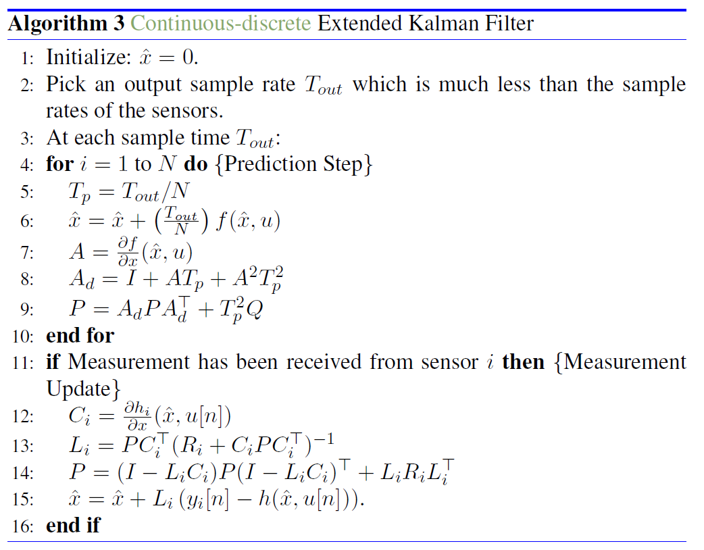

## 记录mavsim值得我学习的地方

### Chapter 1 - 3

1. 所有可以重复使用的变量提前存在parameters中，比如各种gamma，在程序中只是简单的加和乘，减少重复计算过程。
2. 变量名取的和书上一样，取的真是太好了，完全可以像书上一样敲公式。
3. class内部的函数区分权限。_开头的函数和变量是半私有变量，在类外无法调用，在类内可以调用。这比我之前毕设时候的类写的好太多了。以后在写类的时候一定要区分好不同函数和参数的作用域。
   - “_”：以单下划线开头的表示的是**protected类型的变量**，即**只能允许其本身与子类进行访问**；同时表示弱内部变量标示，如，当使用"from moduleNmae import *"时，不会将以一个下划线开头的对象引入。
   - “__”：双下划线的表示的**是私有类型的变量**。只能是允许这个类本身进行访问了，连子类也不可以，**这类属性在运行时属性名会加上单下划线和类名**。
4. 全用numpy可以提速，因为numpy底层是C实现的。在numpy中，用@表示矩阵乘法， 用[[],[]]的形式表示矩阵和列向量，将矩阵和列向量的形式统一起来。
5. 在第三章中，用四阶龙格库塔法求微分方程，真是活学活用！
6. 画的界面特别直观，还能拖动，用pyqt画的。

### Chapter 4
1. 风的模型，需要用计算传递函数。根据transfer_function.py里的程序，具体的实现过程如下：

   1. 给定传递函数计算状态，用可控标准型最小实现得到ABC方程
   2. 结合线性离散系统的计算公式，得到离散状态下的ABC方程
   3. 用矩阵相乘的方式，得到每迭代一步的state

   - remark：在书中假设Va是“a constant nominal airspeed Va0”， 我觉得这可能是与飞行器的设计参数有关。
   - 在最新的程序中，这里改为了龙哥库塔法仿真连续微分仿真。我觉得都可以。**源程序确实存在num和den的顺序反了的问题。**

2. wind里边涉及到的坐标变换我用的是旋转矩阵。之后需要借助rospy或者自己写工具，使用quaternion进行坐标变换。

3. 一开始我以为没有失速在里边，后来发现是电机太强了。如果这个电机太强，由于迎角是机体x轴与空速Va在机体xy平面的投影的夹角，如果这个电机拉力很大，则即使从地面上看已经朝天飞了，但实际并没有失速。如果要体现失速效果，可以用较小的推力和较大的升降舵。

4. 在飞机中，u，v，w是地速Vg在机体坐标系的投影，具体在page18。这里虽然机体坐标系是一直移动的，但还是静系，因为V_g^b的定义是**相对于惯性坐标系的速度**在body坐标系下的投影。

5. gamma chi的数值可以根据书p22的公式推导出来。但是需要注意，arcsin的有效值是-pi/2 to pi/2，arctan的有效值是-pi to pi。 要单独处理分母为0的情况。

6. 想改成用键盘输入，但pyqt的输入好像有点不同，得专门写一下。

7. **在最新的附录中，给了更详细的电机模型。确实原书上的太简单了。**

### Chapter 5

1. 求解trim问题，其实是求解一个最优化问题，使用了scipy.optimize.minimize()函数。现在的问题在于求不到那个相等的解，而且解对初值**特别**敏感。python中是直接求解状态（17个变量），和书上的算法（3个变量）还是很不一样的。~~我觉得这造成了**高维的搜索空间**，导致优化算法**更难收敛**~~。2021.1.21更新：我写的有问题，参考一下youtube上教学视频的结构。
   - 这个改了。要注意，由于我是把forces_and_moments单独拆分开的，因此用到了Va，alpha，beta这些中间变量。在trim.py中计算时，更新设定新状态后，要先使用_update_velocity_data()去得到匹配的中间变量Va等，才能继续使用 _forces_moments(delta)去得到正确的forces和moments。
   - 最后求解还是不对，这里要注重初值的设置。根据书上的，输入设为[0,0,0,1]就都对了！！！
2. trim函数里没有封装转弯半径R。之后如果有需要可以封装一下。用R = np.inf表示直线。
   - 这里有问题。加了R以后，与直线相比**约束项少了5项**，~~导致无法收敛出最终结果~~。
   - 后来发现是我的x_trim_dot写错了。用euler_angle表示的x_trim_dot只需要Va, gamma, Radius就可以定义，而用quaternion表示的x_trim_dot需要p_trim, q_trim, r_trim和e_trim进行转化，前3者可以搞定，但**e_trim（trim态下的四元数）无法得到**。==**这是一个欧拉角无法被四元数替代的例子！**==
3. 对于非线性方程，有等式约束，可以采用SLSQP方法，详见https://docs.scipy.org/doc/scipy/reference/tutorial/optimize.html#sequential-least-squares-programming-slsqp-algorithm-method-slsqp。
4. ~~这一章编的程序（线性化模型）对之后章节的作业没有影响。~~ 光速打脸，我又得补这一章的作业了。。。
5. 这一章需要的C_X_0, C_X_alpha等参数书中没有给出计算公式，如果要实现需要查一下书中参考的资料。
6. **编写这一章的时候，发现transfer_function.py的编写有问题！！！和matlab版本里边的不一样。需要修改一下！**
7. 计算微分：使用数值方法 (f(t+epsilon) - f(t))/epsilon

### Chapter 6

1. delta的顺序改为e，a，r，t
2. 类的命名用驼峰命名法
3. 关于为何在pid控制的说明：
   1. 首先在程序里error的定义是y_ref-y，这样实际上就已经是负反馈了，y过大了是负的，所以在控制类里不用加负号。
   2. 其次，程序里出现了一种PdControlWithRate。这里说白了就是用真实的y的导数替代我们用Z变换得到的error_dot量。由于y_ref的导数为0，所以error = y_ref - y的导数就变为了 - y_dot
4. Yaw Damper using the Rudder 是补充材料里的新内容。对于小型飞机，如果侧滑角无法测量，则书中p105的公式需要替换成补充材料中的内容，用Yaw Damper的方式控制侧滑角为0。
5. autopilot：串级PID调参很麻烦。以后有时间试试能量法或者LQR控制。
6. 看看能不能训练一个**强化学习**网络控制

### Chapter 8

1. 对于EKF，要搞清每个矩阵的含义。解释一下propagate_model里的含义:

P阵定义为误差的协方差
$$
P(t) \triangleq E\left\{\tilde{x}(t) \tilde{x}(t)^{\top}\right\}
$$
进而
$$
\dot{\tilde{x}}=A \tilde{x}+\xi=A \tilde{x}+G\eta_s+\eta_i
$$
其中第一个eta是由于传感器的误差造成的误差项，第二个eta是建模等不可知因素造成的误差项。又因为如下公式：
$$
E\left[\left(G \eta_{s}+\eta_{i}\right)\left(G \eta_{s}+\eta_{i}\right)^{\top}\right]=G Q_{s} G^{\top}+Q_{d}
$$
所以，第9行的公式修改为：
$$
P=A_dPA_d^T+T_p^2(G Q_{gyro} G^{\top}+Q)
$$

2. Q值确实会较大影响估计的效果。
   $$
   E\{\xi(t)\xi(\tau)\}=Q\delta(t,\tau)
   $$
   Q表示建模的误差，确实得调整。具体咋调感觉还得实际做的搞一下，仿真还是不行。
   
3. **TODO**： 全状态EKF观测器

### Chapter 10

- 这一章对风的考虑只有wn和we。以后有空了可以看看怎么把wd也作为状态。

- 如果用估计的状态，振荡非常严重。这里估计是state_estimation那里没调好，之后需要调整一下。

- 在这一章中作者用了math里的sin, cos和atan2. 根据网址：https://stackoverflow.com/questions/30712402/python-what-is-the-difference-between-math-exp-and-numpy-exp-and-why-do-numpy-c 

  > The numpy version is ~9x faster (and probably can be made faster still by a careful choice of optimized math libraries)
  >
  > As @camz states below - the `math` version will be faster when working on single values (in a quick test, ~7.5x faster). 

  因此，计算标量时用math，计算数组时用numpy。

- **TODO**：3D vector-field path following

### Chapter 11

- a 是一个二维的array。a[:, 1:2]返回的是一个二维数组，a[:,1]返回的是一个一维数组。
- is True和==True的区别：对于is True，只有遇到bool值True时才会执行，遇到和True一样的1时也不会执行。
- **一定要注意变量的作用域。**如果在一段程序中同一个变量被重复赋值，则当这个变量停止作用时，应该用del命令删除！！！！！
- TODO： 2. 将不同的路径跟踪算法解耦。